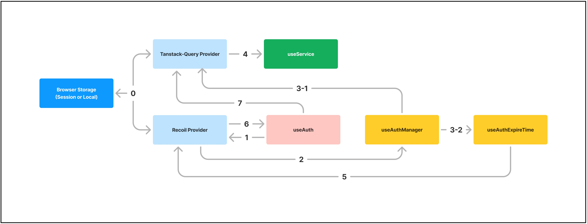

## 1. Introduction

- 인증/서비스 로직 관리를 위한 React Custom Hook 기반의 모듈입니다.

- 로그인/로그아웃 처리, 인증 데이터 갱신/만료, HTTP/HTTPS 통신 기본 로직을 수행합니다.

- Custom Hook의 관심사를 분리하여 디버깅이 용이하도록 설계하였습니다.

- Custom hook의 Config/Parameter 변경으로 간단하게 세부 동작을 제어할 수 있도록 제작되었습니다.

## 2. Dependencies (Libraries Used)

- recoil (^0.7.7)

- recoil-persist (^5.1.0)

- @tanstack/react-query (^5.51.23)

- @tanstack/query-sync-storage-persister (^5.51.21)

- @tanstack/react-query-persist-client ("^5.45.1)

## 3. Structure (Directories and Files)

<pre>
┣ 📂src
┃ ┣ 📂aboutReactQuery
┃ ┃ ┣ 📜filterStoredQueries.ts
┃ ┃ ┣ 📜QueryProvider.tsx
┃ ┃ ┗ 📜useGetCachingData.ts
┃ ┣ 📂atom
┃ ┃ ┣ 📜authExpireTimeAtom.ts
┃ ┃ ┣ 📜authStateAtom.ts
┃ ┃ ┗ 📜authTypeAtom.ts
┃ ┣ 📂type
┃ ┃ ┗ 📜type.ts
┃ ┣ 📂useAuth
┃ ┃ ┗ 📜useAuth.ts
┃ ┣ 📂useAuthManager
┃ ┃ ┣ 📜useAuthExpireTime.ts
┃ ┃ ┗ 📜useAuthManager.ts
┃ ┣ 📂useService
┃ ┃ ┗ 📜useService.ts
┃ ┣ 📂util
┃ ┃ ┣ 📜convertMillisecondsToMMSS.ts
┃ ┃ ┣ 📜findValueByKey.ts
┃ ┃ ┗ 📜selectNecessaryData.ts
┃ ┗ 📜config.ts
</pre>

#### 1) useAuth

##### 
- 로그인/로그아웃과 이에 파생되는 작업을 수행합니다

#### 2) useAuthManager

##### 
- 로그인 이후 인증 데이터 관리 작업을 담당합니다. (인증 데이터 갱신/만료 관련)

- useAuthManager : 인증 데이터 갱신 관련 작업 수행
- useAuthExpireTime : 인증 데이터 만료 관련 작업 수행

#### 3) useService

##### 
- HTTP/HTTPS 통신 관련 기본 로직을 담당합니다.

#### 4) aboutReactQuery

##### 
- 모듈 구현 시 사용되는 tanstack-query 활용과 관련된 함수 및 Provider 입니다.

- QueryProvider : tanstack-query 저장소 활용을 위해 설정해야 하는 Provider
- filterStoredQueries : tanstack-query로 캐싱한 데이터를 브라우저 스토리지와 연동할 때 사용되는 함수  (캐싱 데이터 중 필요한 것만 선택해서 스토리지에 sava/load 할 수 있도록 처리)
- useGetCachingData : tanstack-query로 캐싱한 데이터를 필요한 컴포넌트에서 호출할 때 사용되는 Custom Hook

#### 5) etc (config, type, atom, util)

##### 
- 모듈 구성에 활용되는 기타 요소들입니다.

- config : 모듈 관련 세부 설정 (브라우저 저장소 선택, 서버 API 엔드포인트 지정)
- type : useAuthManager 관련된 type 입니다.
- atom/authExpireTimeAtom : 인증 만료시간 관련 전역상태 입니다.
- atom/authStateAtom : 로그인 여부와 관련된 전역상태 입니다.
- atom/authTypeAtom : 인증 방식에 관련된 전역상태 입니다. (JWT Token 방식인지, 서버 Session 방식인지)
- util/convertMillisecondsToMMSS : 인증 만료시간 관련 밀리세컨드를 MM:SS 형태로 변경해주는 함수
- util/selectNecessaryData : 인자로 전달한 key 값과 동일한 객체의 프로퍼티 value를 반환하는 함수 (서버 Response에서 인증 데이터 추출할 때 활용)

## 4. Logic (How it Works)

##### 0) 초기 값 지정

- 브라우저 스토리지에 저장된 데이터 있는지 체크 후, 있을 시 초기 값으로 지정
- 관련 데이터 : 로그인 상태 (AUTH_STATE), 인증 정보 (AUTH_INFO)
- 로그인 상태, 인증 정보 갱신될 때마다 브라우저 스토리지 데이터 역시 갱신 됨

##### 1) 최초 로그인 (브라우저 스토리지에 저장된 데이터 없다고 가정)

- 로그인 페이지에서 로그인 시, Recoil Provider로 관리 중인 전역 상태 변경 됨 (authAtom)

##### 2) 인증 정보 관리 (초기 값 설정, 갱신)

- authAtom 의 상태 변경이 useAuthManager로 전달 됨
- 이를 통해 최초 로그인임을 인지하고, 초기 인증 값을 받아옴 (setInitAuth 함수 호출)
- 만약 갱신 조건이 참이라면 (useAuthManager의 파라미터 중, isRenew) 갱신 주기 (renewInterval) 에 맞춰 인증 값 갱신 (setAuthRenew 함수 반복 호출)

##### 3-1) 인증 정보 캐싱 처리

- 서버에서 인증 정보를 수신할 때마다 tanstack-query Provider를 활용하여 데이터 캐싱 처리 수행 (설정한 key 값에 매핑)
- 최초 인증 정보 key : loginInfo
- 갱신 인증 정보 key : tokenInfo

##### 3-2) 인증 만료 시간 설정

- 최초 로그인 시 받아온 데이터 중 인증 만료시간 (expireTime) 활용하여 만료 카운트 다운 실행
- 특정 동작 (새로고침, 페이지 경로 변경) 수행 시 만료 시간 초기화

##### 4) 인증 정보 활용

- tanstack-qeury Provider 에 캐싱해놓은 인증 정보 활용하여 HTTP/HTTPS 통신 (haeder의 Authorization 설정)

##### 5) 인증 정보 만료

- 인증 정보 만료될 시 로그아웃 상태로 변경 (authAtom 변경)

##### 6) 로그아웃 관련 처리

- useAuth에서 변경된 authAtom을 감지하고 로그아웃 관련 작업 처리
<ul>
<li>로그인 페이지로 브라우저 경로 이동</li>
<li>tanstack-query Provider에 캐싱된 데이터 제거 요청</li>
<li>브라우저 스토리지에 저장된 데이터 제거</li>
</ul>

##### 7) 캐싱 데이터 제거

- useAuth에서 보낸 요청을 수신하여 캐싱된 인증 데이터 제거 (loginInfo, tokenInfo)

## 5. Usage (Sample Code)

- 설정 관련 샘플

## 6. issue

- recoil 교체 필요성
